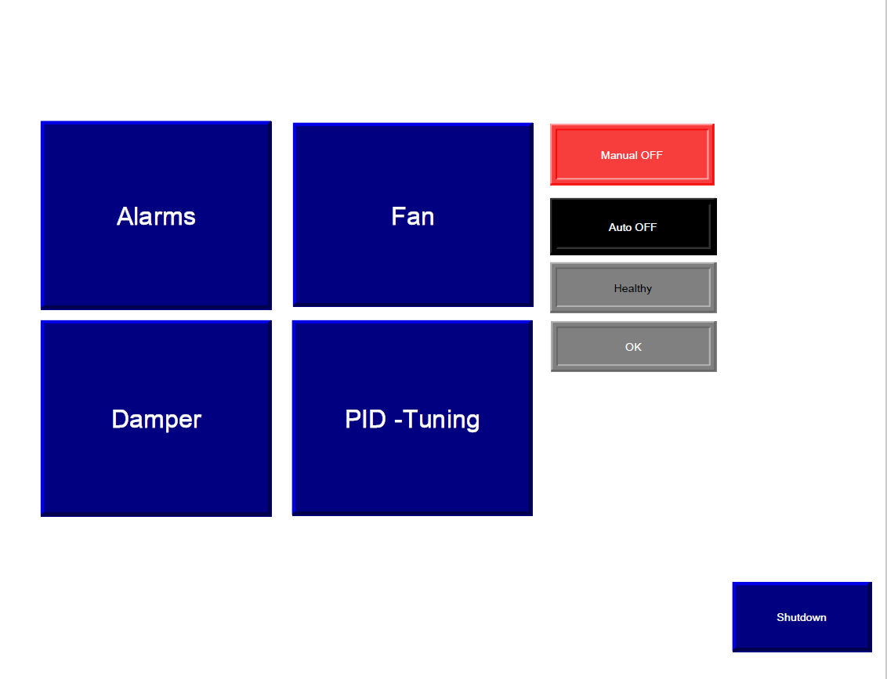
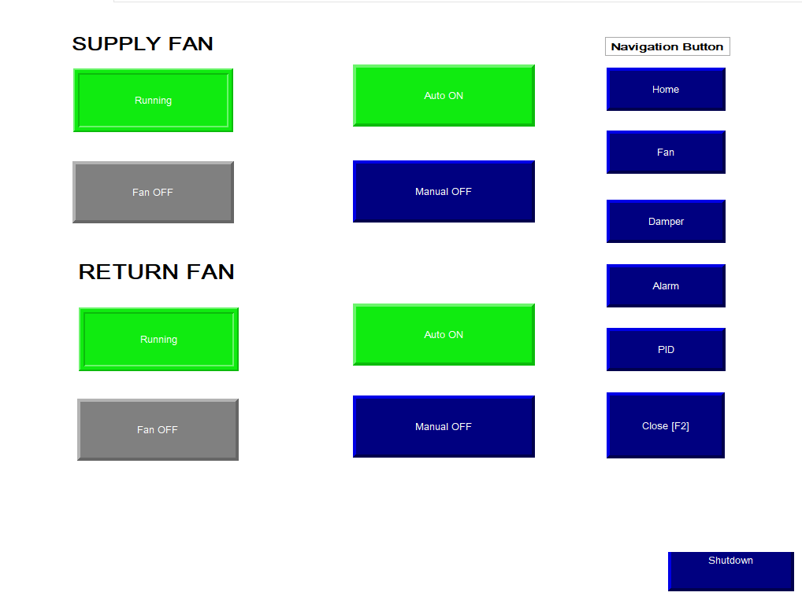
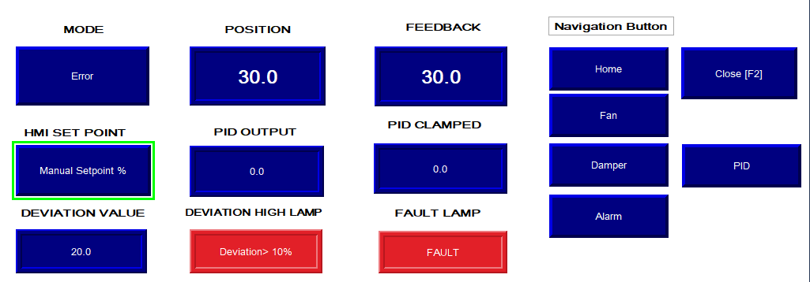
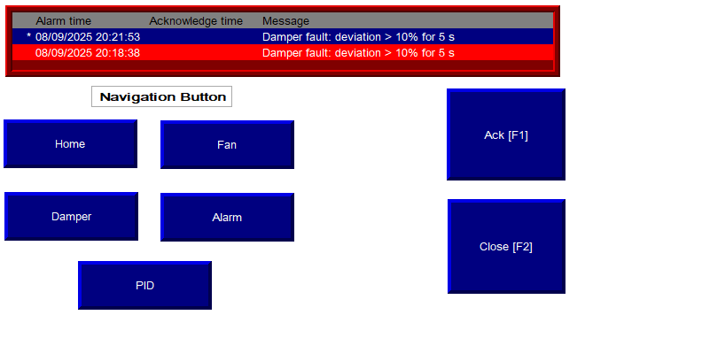
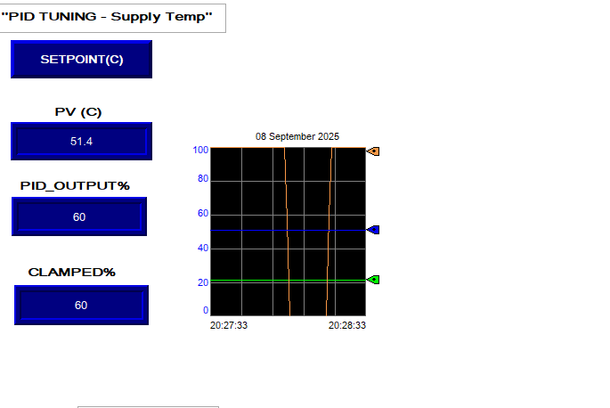

# 🌬️ Project 1: HVAC Control System with PID, Damper & Alarm Handling

This project simulates a real-world **HVAC control system** using **Rockwell Studio 5000** and **FactoryTalk View SE HMI**. It features Auto/Manual mode handling, PID-based damper regulation, reusable AOI/UDT structures, and a full alarm/notification system.

---

## 🧠 System Overview

- Auto & Manual operating modes with interlocks
- PID loop for temperature control (damper modulation 0–100%)
- Supply and Return fans controlled via **AOI_FanControl**
- Deviation-based damper fault detection (>10% for 5s)
- Alarm latching with buzzer & reset
- Modular routines: `IO_MAP`, `MODE_HANDLING`, `TEMP_PID`, `DAMPER_CONTROL`, `FAN_CONTROL`, `FAULT_MONITOR`, `ALARM_HANDLER`
- HMI navigation: Home, Fan, Damper, PID, Alarm

---

## 📄 Project Reports

### 1. Final Report  
Full design report covering objectives, hardware/software setup, logic flow, tag lists, UDTs, AOIs, and test procedure.

<embed src="HVAC_Control_System_Final_Report.pdf" width="100%" height="600px" type="application/pdf">

[📥 Download Final Report PDF](HVAC_Control_System_Final_Report.pdf)

---

### 2. Ladder Logic with Rung Comments  
Documented ladder routines with rung-by-rung comments for IO, Mode, PID, Fan, Damper, Faults, and Alarms.

<embed src="LadderLogic.pdf" width="100%" height="600px" type="application/pdf">

[📥 Download Logic PDF](LadderLogic.pdf)

---

## 🖼️ HMI Screens (FactoryTalk View SE)

### Home / Navigation  

### Fan Control Screen  

### Damper Control Screen  

### Alarm Banner & Acknowledgment  

### PID Tuning & Trending  

These screens demonstrate:
- Auto/Manual selection and mode lamps  
- Fan status, start/stop, and feedback  
- Damper command vs feedback + deviation alarms  
- PID tuning interface with PV/SP/output trending  
- Alarm banner with Ack/Reset  

---

## 🧪 Testing & Results

- Fans start automatically in Auto mode  
- Manual mode allows direct fan & damper control via HMI  
- PID loop regulates damper position to maintain setpoint  
- Damper fault alarm triggers correctly (>10% deviation for 5s)  
- E-Stop immediately latches system fault  
- Alarm buzzer & reset tested successfully  

---

[🔙 Back to Projects](../../projects)

